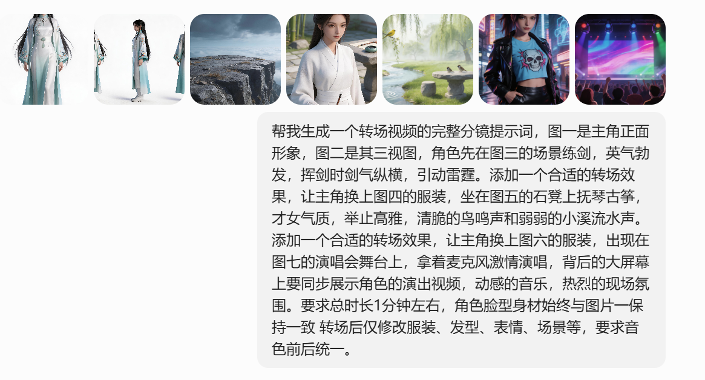

# 分镜脚本

## 豆包生成脚本提示词

## 豆包输出分镜脚本
一、开篇定调（0-5秒）
镜头1：角色亮相

- 画面：以图一为核心，主角正面站立，身着白青渐变古风长袍，黑长直披肩，佩戴玉饰，背景纯白。

- 运镜：缓慢推近至面部特写，眼神清冷坚定。

- 音效：轻微衣料摩擦声，营造沉静气场。

---
二、第一幕：云巅练剑（5-20秒）

镜头2：场景切入

- 画面：转至图三云海悬崖场景，主角立于崖边石台上，手持长剑，衣袂被山风拂动。

- 运镜：从远景拉至中景，展现悬崖险峻与云海翻涌。

- 音效：山风呼啸，剑鸣低吟。

镜头3：剑气纵横

- 画面：主角挥剑出招，剑气如白练划破空气，引动云层翻涌，天空闪过紫电。

- 运镜：跟随剑招快速移动，捕捉剑气轨迹与雷霆光影。

- 音效：剑啸破空声，雷霆轰鸣，风声加剧。

镜头4：收势定格

- 画面：剑收于身侧，剑气消散，主角立于崖边，衣摆垂落，眼神锐利。

- 运镜：慢镜头回放挥剑瞬间，最后定格在正面姿态。

- 音效：余音袅袅，雷声渐远。

---
三、转场1：云巅化境（20-25秒）

转场效果：水墨晕染转场

- 画面：练剑场景被淡青色水墨晕染覆盖，墨色中浮现竹林、石桌轮廓，逐渐过渡到图五的庭院场景。

- 音效：水墨晕染的沙沙声，古筝前奏渐入。

---
四、第二幕：竹院抚琴（25-40秒）

镜头5：场景切换

- 画面：主角换上图四的素白交领汉服，发型改为高髻配白玉簪，坐在图五的石凳上，面前摆放古筝。

- 运镜：从远景推至中景，展现竹林、溪流、石桌的雅致环境。

- 音效：古筝轻弹，溪流潺潺，鸟鸣清脆。

镜头6：抚琴特写

- 画面：手指轻拨琴弦，琴音流转，主角神情温婉，眼神柔和，衣摆随动作微动。

- 运镜：特写手指与琴弦，拉远至半身，捕捉侧脸轮廓。

- 音效：古筝旋律渐强，鸟鸣与流水声交织，营造静谧雅致氛围。

镜头7：意境定格

- 画面：主角垂眸抚琴，竹影摇曳，溪水涟漪，石桌上的笔墨纸砚清晰可见。

- 运镜：慢镜头环绕，捕捉光影与衣料质感。

- 音效：琴音渐缓，余韵悠长。

---
五、转场2：霓虹破境（40-45秒）

转场效果：霓虹碎裂转场

- 画面：竹院场景被霓虹光效碎裂，碎片重组为图七的演唱会舞台，灯光闪烁，人群欢呼。

- 音效：玻璃碎裂声，电子乐前奏爆发，观众欢呼声渐起。

---
六、第三幕：舞台燃唱（45-60秒）

镜头8：舞台登场

- 画面：主角换上图六的黑色皮夹克+骷髅T恤+皮裙，高马尾造型，手持麦克风站在舞台中央，背后大屏幕同步播放其演出视频（包含练剑、抚琴片段剪辑）。

- 运镜：从舞台全景拉至主角特写，捕捉灯光在皮衣上的反光。

- 音效：动感电子乐，观众欢呼声，麦克风试音声。

镜头9：激情演唱

- 画面：主角随节奏舞动，眼神炽热，歌声激昂，大屏幕同步切换演出画面，摇头灯扫过人群。

- 运镜：快速切换近景、中景、全景，捕捉舞台灯光与观众互动。

- 音效：歌声清晰有力，电子乐节奏强劲，观众欢呼声此起彼伏。

镜头10：高潮收尾

- 画面：主角抬手致意，大屏幕定格其正面形象，灯光汇聚，全场欢呼。

- 运镜：慢镜头回放演唱高潮瞬间，最后定格在舞台中央。

- 音效：音乐骤停，欢呼声达到顶峰，余音回荡。

---
核心一致性要求

1. 角色统一：全程保持图一的脸型、身材比例，仅修改服装、发型、表情、场景。

2. 音色统一：练剑时的剑啸、抚琴时的古筝、演唱时的歌声，均由同一音色演绎，确保听觉连贯。

3. 风格衔接：转场效果自然融合古风与赛博元素，避免割裂感。

## 自定义调整
一、开篇定调（0-5秒）
镜头1：角色亮相
- 画面：@图片1 是主角凌霜正面形象，@图片2 是其三视图，凌霜正面站立在 @图片3【全局场景/苍凉高山之巅】 山巅的大片平地中央（双脚约处在图片的水平垂直中心位置），全程走在地面上不要踏空，身着白青渐变古风长袍，黑长直披肩，佩戴玉饰，右手持一柄漂亮奢华的青白玉剑，右臂伸直与剑身保持同一直线，剑尖斜向下指向地面。
- 运镜：缓慢推近至面部特写，眼神清冷坚定，嘴巴完全闭合，不要有转头动作，凸显其高贵清冷性格，随着右手缓缓向上挥剑镜头向后拉直到显示出角色全身，同时有缓慢眨眼动作，剑身短暂闪烁反射的寒光，动作表情不要太僵硬。
- 音效：轻微衣料摩擦声，轻微的风吹声，营造沉静气场。
===============================================================================================
二、第一幕：云巅练剑（5-20秒）

镜头2：场景切入
- 画面：转至 @图片3【全局场景/苍凉高山之巅】，主角立于崖边石台上，手持长剑，衣袂被山风拂动。
- 运镜：从远景拉至中景，展现悬崖险峻与云海翻涌。
- 音效：山风呼啸，剑鸣低吟。

镜头3：剑气纵横
- 画面：主角挥剑出招，剑气如白练划破空气，引动云层翻涌，天空闪过紫电。
- 运镜：跟随剑招快速移动，捕捉剑气轨迹与雷霆光影。
- 音效：剑啸破空声，雷霆轰鸣，风声加剧。
===============================================================================================
延长 @视频1【分镜2~3末尾截取5s】 6s进行片段收尾， @图片1【凌霜正视图】 为主角正面形象参考图 
镜头4：收势定格 
- 画面：剑收于身侧，剑气消散，主角立于崖边，衣摆垂落，眼神锐利。 
- 运镜：慢镜头回放挥剑瞬间，最后定格在正面姿态。 
- 音效：余音袅袅，雷声渐远。
===============================================================================================
四、第二幕：竹院抚琴 

镜头5：场景切换 
- 画面：@图片1【凌霜正视图】 换上 @图片2【古风纯白色才女素衣】的素白交领汉服，发型改为高髻配白玉簪，坐在 @图片3【全局场景/溪边石桌春天】 的石凳上，面前摆放古筝。 
- 运镜：从远景推至中景，展现竹林、溪流、石桌的雅致环境。 
- 音效：古筝轻弹，溪流潺潺，鸟鸣清脆。 

镜头6：抚琴特写 
- 画面：手指轻拨琴弦，琴音流转，主角神情温婉，眼神柔和，衣摆随动作微动。 
- 运镜：特写手指与琴弦，拉远至半身，捕捉侧脸轮廓。 
- 音效：古筝旋律渐强，鸟鸣与流水声交织，营造静谧雅致氛围。 

镜头7：意境定格 
- 画面：主角垂眸抚琴，竹影摇曳，溪水涟漪，石桌上的笔墨纸砚清晰可见。 
- 运镜：慢镜头环绕，捕捉光影与衣料质感。 
- 音效：琴音渐缓，余韵悠长
===============================================================================================
【Seedance2.0对图片审核比较严格，需要先手动生成凌霜皮衣正视图再引用，直接上传“赛博朋克叛逆少女皮夹克.png”会审核不通过】
六、第三幕：舞台燃唱（45-60秒）

镜头8：舞台激情演唱
- 画面：@图片1【凌霜皮衣正视图】手持麦克风站在 @图片3【全局场景/演唱会舞台】 舞台中央演唱 @音频1【全局音频/音乐/少年勇敢前行】，背后大屏幕同步播放其演出视频。主角随节奏舞动，眼神炽热，歌声激昂，大屏幕同步切换演出画面，摇头灯扫过人群。主角抬手致意，大屏幕定格其正面形象，灯光汇聚，全场欢呼。
- 运镜：从舞台全景拉至主角特写，捕捉灯光在皮衣上的反光。快速切换近景、中景、全景，捕捉舞台灯光与观众互动。慢镜头回放演唱高潮瞬间，最后定格在舞台中央。
- 音效：歌声清晰有力，电子乐节奏强劲，观众欢呼声此起彼伏。